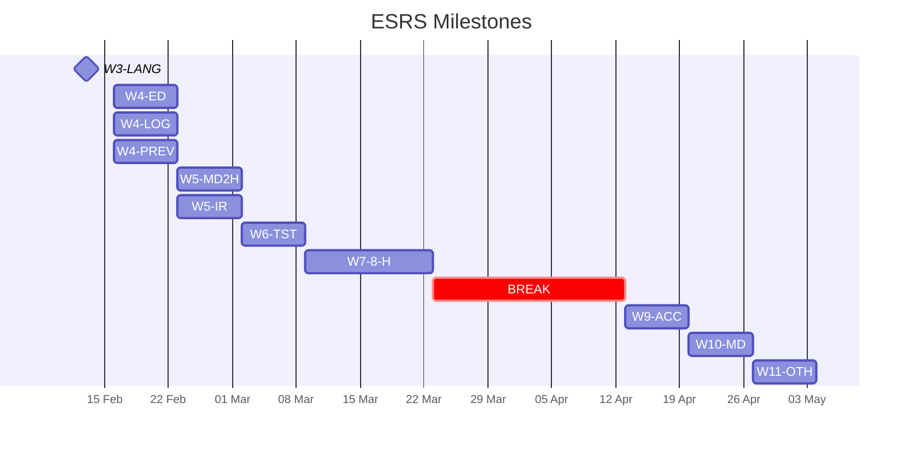
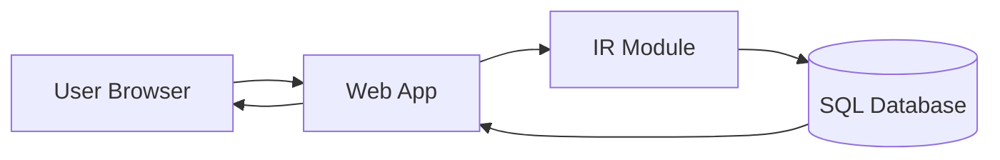

# Project Specification
# WriteOnce Blog Engine

## Summary

The WriteOnce Blog Engine is a flexible and secure blog engine, similar to WordPress, but with a much more powerful way of handling how posts are written, stored and displayed.
The innovative part of the project is that the blog posts are stored as 'intermediary representation (IR)' that allows them to be written in a range of languages, but also displayed and exported in other formats in the future, whilst still maintaining their formatting. In this 12 week project we will develop a prototype of the Blog Engine and if time allows add functionality around accessibility, security and improvements to the user interface.

## Team roles

Project Manager: Paula Blackledge

Technical Lead: Mei Happs

Frontend Developer: Max De La Nougerede

Backend Developer: Tim Bartlett

## Intended audience

The blog engine is an ideal solution for writers and organisations that need flexible ways to write blogs. They can write the blogs in a format that suits them whilst still producing clean and well formatted posts, that meet good standards by default. For those working on a blog within a team, the flexibility of the IR means different people can work on the blogs in their preferred format and it also future proofs the blogs as the post can be re-exported in multiple formats.

## Constraints of the approach
Our WriteOnce Blog Engine will be based around a single structured representation, so a major constraint is that we may not be able to represent all required strucutural text features within this model. Alongside this, because of time restrictions, it is unlikely we will produce a version on WriteOnce that will provide a rich interface for blog editors. These constraints are traded off by the long-term advantages of the approach that allows for easy conversion to other formats whilst still maintaing it's structure.

### Core features
##### High priority features:
- IR implementation, priority IR to HTML
- Storage (SQL)
- Authentification/user accounts
- Basic editor function
- Markdown export
- HTML import
  
##### Lower priority features:
- Accessibility checker
- Import/export other formats
- Improvements to blog editor 
- Custom parser

# Milestone

- Decide on systems language for IR handling (by 13th February) - LANG 
- Usable editor supporting pure html (syntax highlighting in a textbox) (week 4) - ED
- Secure login area finished (week 4) - LOG
- Live preview (week 4) - PREV
- Support for markdown generating html directly (week 5) - MD2H
- Intermediary representation fully specified (week 5) - IR
- Start Testing (week 6) - TST
- IR to html and vice versa supported (week 7+8) - H
- Accessibility checker (week 9) - ACC
- IR to markdown and vice versa supported (week 10) - MD
- IR to other formats (week 11) - OTH



## Infrastructure

### Architecture Diagram


### Routing

We'll need some form of routing. Exact router is still to be decided on.

The routes we would need to provide would be:
- a home page (this would probably list blog posts in some searchable and/or ordered manner)
- a general route for blog posts
- a route for the secure admin area

### Post formatting and storage

This will partially come down to how we decide to format the posts. We have many choices here, such as:
- Plaintext with predefined plaintext sequences for "special" datatypes. i.e. in markdown i think you can use something like:
  ```
  ![[image_name]]
  ```
  to get images inserted into your plaintext.
- Some structured format like json or some other languages object notation in which a similar kind of thing would be encoded with:
  ```
  [
    {
      "type": "plaintext",
      "content": "some text"
    },
    {
      "type": "image",
      "image_path": "./imgs/some_image.png"
    },
    {
      "type": "plaintext",
      "content": "some more text"
    }
  ]
  ```
- raw html (not preferred (icky))

Once format is established, we can worry about storage. Different formats lend themselves better to different storages, but a standard sql database probably won't be able to work with this without introducing a lot of jank.

### Security

Security for users is a priority for this system, but due to the short timeline and the need to prioritise the core element of the project (The IR development), we propose to use Hanko as a pre-built option (https://github.com/teamhanko/hanko), as this provides with an easy to use but very secure and easy to use solution that is built on privacy first principles. Alternatives we considered were: Sessions and JWT.


### Intermediary Representation

This will be the core of the project.

With an intermediary representation, we can allow for many different "views" of a post, i.e. the intermediary representation isn't readible or directly usable but can easily be converted to and from html (priority no. 1), markdown, org and other plaintext formats. While viewing the post in another format, it's important to remember that the view is not a source of truth, just another way of looking at the intermediary representation for readibility.

Here is an example format:
```md
# Example header

Some example paragraph.

- A
* Bulleted
- List
  - Maybe with
  - Indentation levels

1. Or even a
2. Numbered one
  - Maybe even
  - With a bulleted list under it
```

```IR
Header(level: 1, "Example header"),
LineBreak(),
"Some example paragraph.",
LineBreak(),
BulletedList([
  Bullet(bullet_character: {BulletCharacter::Markdown::Hyphen}, "A"),
  Bullet(bullet_character: {BulletCharacter::Markdown::Asterisk}, "Bulleted"),
  Bullet(bullet_character: {BulletCharacter::Markdown::Hyphen}, "List"),
  BulletedList(
    Bullet(bullet_character: {BulletCharacter::Markdown::Hyphen}, "Maybe with"),
    Bullet(bullet_character: {BulletCharacter::Markdown::Hyphen}, "Indentation levels")
  )
]),
LineBreak(),
NumberedList([
  Number("Or even a"),
  Number("Numbered one"),
  BulletedList([
    Bullet(bullet_character: {BulletCharacter::Markdown::Hyphen}, "Maybe even"),
    Bullet(bullet_character: {BulletCharacter::Markdown::Hyphen}, "With a bulleted list under it")
  ])
])
```

```IR types
Header(level: int, str)
LineBreak()
BulletedList(list[Bullet | BulletedList | NumberedList])
Bullet(bullet_character: set[BulletCharacter], str)
NumberedList(list[Number | NumberedList | BulletedList])
Number(str)

BulletCharacter {
  Markdown {
    Hyphen => "-", # default
    Asterisk => "*"
  }
}
```

This example is not a perfect representation, but it should hopefully get the idea across. 
The types need to be exhaustive enough to cover everything in each domain while also ensuring it's possible to map every domain to the intermediary representation.

As an example, bullet_character is a set of enforced characters. This is because one domain may not have more than one bullet character, and therefore wouldn't enforce a bullet character when you write in it but other domains, like markdown, do. This approach allows for you to write in one format that has multiple bullet characters, edit in another format that has multiple bullet characters and have each time you view it maintain the characters you chose in both languages while also allowing languages with only one bullet character to not have to enforce any kind of memory.

In terms of actually parsing these formats, we are considering using Treesitter (https://github.com/tree-sitter/tree-sitter) rather than making it from the ground up ourselves. Treesitter is well-established and consistent. This is a potential source of risk to the project as it may not meet out needs, but in favour of a faster iteration time we have decided to start with Treesitter with a view to potentially replacing it with our own custom parser if time allows. 

### Language and Technology Stack

After evaluating several options for implementing the intermediary representation and overall system architecture, we have decided to use TypeScript for the entire project stack. This section outlines our evaluation process and rationale.

#### Language Evaluation (Mei Happs)

##### Rust

Advantages:
- Exceptionally robust type system with algebraic data types (enums with associated data)
- Native pattern matching with exhaustive checking and destructuring
- Zero-cost abstractions and excellent performance characteristics
- Memory safety guarantees without garbage collection
- Strong support for functional programming paradigms
- TreeSitter has excellent Rust bindings
- Can compile to WebAssembly for potential browser integration

Disadvantages:
- Steep learning curve, particularly around ownership and borrowing concepts
- Only one team member has prior Rust experience
- Ecosystem instability: frequent breaking changes in frameworks and libraries
- Documentation outside of core language resources is often inconsistent or outdated
- Framework churn would introduce timeline risk in a 12-week project

##### TypeScript

Advantages:
- Entire team has experience with JavaScript/TypeScript
- Genuinely robust type system with discriminated unions and type narrowing
- Exhaustive type checking at compile time
- Mature, stable ecosystem with well-documented libraries
- Seamless integration between frontend and backend (one language throughout)
- Strong TreeSitter bindings available
- Large community means extensive Stack Overflow/documentation resources
- Fast iteration and development velocity
- End-to-end type safety from database to UI

Disadvantages:
- Not a systems language - lower raw performance than Rust
- Types exist only at compile time, requiring runtime validation for external data
- No native pattern matching syntax
- Less elegant syntax for complex type transformations compared to Rust
- Type system, while sophisticated, requires more verbose type definitions for complex cases

##### C++

While C++ offers performance characteristics similar to Rust, it is a poor fit for our requirements:

- Type safety: C++ lacks algebraic data types and exhaustive pattern matching. Implementing our IR would require error-prone manual type checking with `dynamic_cast` or visitor patterns
- Memory safety: Manual memory management introduces entire categories of bugs (use-after-free, memory leaks, buffer overflows) that are completely avoided in both Rust and TypeScript
- Modern tooling: C++ build systems and dependency management are notoriously complex compared to cargo (Rust) or npm (TypeScript)
- Development velocity: The combination of manual memory management, weak type safety for sum types, and verbose syntax would significantly slow development

C++ represents the worst of both worlds for our use case: the complexity of a systems language without the safety guarantees of Rust, and none of the developer ergonomics of TypeScript.

#### Bridging the Gap: ts-pattern

One of TypeScript's main limitations compared to Rust is the lack of native pattern matching syntax. However, the `ts-pattern` library provides sophisticated pattern matching capabilities that closely approximate Rust's experience:

Features provided by ts-pattern:
- Exhaustive pattern matching with compile-time checking
- Destructuring in pattern expressions
- Guard clauses with `P.when()`
- Nested pattern matching for complex data structures
- Type narrowing with full TypeScript integration
- Pattern matching on values, not just types

Example comparison:
```typescript
import { match } from 'ts-pattern';

function renderNode(node: IRNode): string {
  return match(node)
    .with({ kind: 'header', level: 1 }, ({ content }) =>
      `<h1>${content}</h1>`)
    .with({ kind: 'header' }, ({ level, content }) =>
      `<h${level}>${content}</h${level}>`)
    .with({ kind: 'bulletList' }, ({ items }) =>
      `<ul>${items.map(renderBullet).join('')}</ul>`)
    .with({ kind: 'numberedList' }, ({ items }) =>
      `<ol>${items.map(renderNumber).join('')}</ol>`)
    .exhaustive(); // Compiler error if cases are missing
}
```

This provides the functional, type-safe transformation logic that makes Rust pleasant to work with, while maintaining TypeScript's accessibility and ecosystem stability.

ts-pattern details:
- Actively maintained community library
- Mature, stable API
- Adds minimal runtime overhead
- Will be central to our IR transformation pipeline

#### Final Decision: TypeScript

Given our project constraints and goals, we have chosen TypeScript for the following reasons:

Team and Timeline Alignment:
With 12 weeks and only one team member experienced in Rust, TypeScript maximizes our development velocity and allows all team members to contribute effectively from day one.

Technical Sophistication:
TypeScript's type system, enhanced with `ts-pattern`, provides the type safety and pattern matching capabilities necessary for sophisticated IR transformations. We can demonstrate technical depth through:
- Complex discriminated union types modeling our IR
- Exhaustive pattern matching for bidirectional transformations
- TreeSitter integration for parsing
- End-to-end type safety across the entire stack
- Property-based testing for IR transformation correctness

Ecosystem Maturity:
The stable TypeScript/Node.js ecosystem reduces risk of mid-project breaking changes, ensuring we can focus on delivering features rather than fighting tooling issues.

Performance Adequacy:
For a blog engine, TypeScript's performance is more than sufficient. The IR transformations are not computationally intensive enough to warrant systems-language performance characteristics.

This approach prioritizes delivering a complete, well-architected system on schedule while maintaining the technical sophistication expected of a masters-level project.

### Secure Admin Area

#### Post creator

There would be a few parts to this creator:
- Editor
- (live?) Preview
- Publishing
- Save without publishing
- Save and publish
- Delete/archive

#### Editor + Preview

##### Minimum Viable Product:
- A textbox with an iframe next to it that contains the processed contents of the textbox, refreshing on a time delay with some processing in between

##### Mid-viable product:
- Can we somewhere inbetween these two options consider an accessibility checker/enforcer or the parser by default making accessibility add-ons? Would forcing them to write a summary or opening paragraph from which metadata/blog post summmary be pulled

##### Maximum Feasible Product:
- A fully embedded live preview and editor in the same pane, similar to what obsidian does, in which only the line being edited is shown as plaintext while the rest is properly rendered

### Testing and ownership
Within the time constraints we intend to robustly test the product throughout its development, team ownership for testing will be:
- Unit testing: Mei Happs
- API tests: Mei Happs
- Continuous Integration testing: Mei Happs
- User testing: Paula Blackledge

